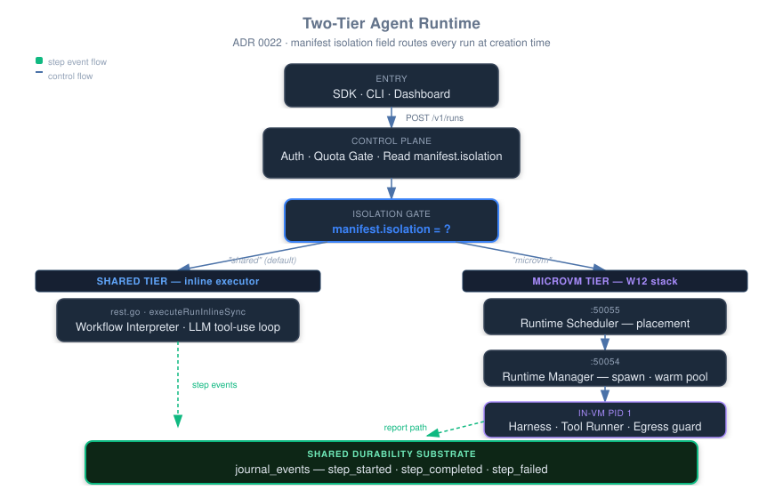
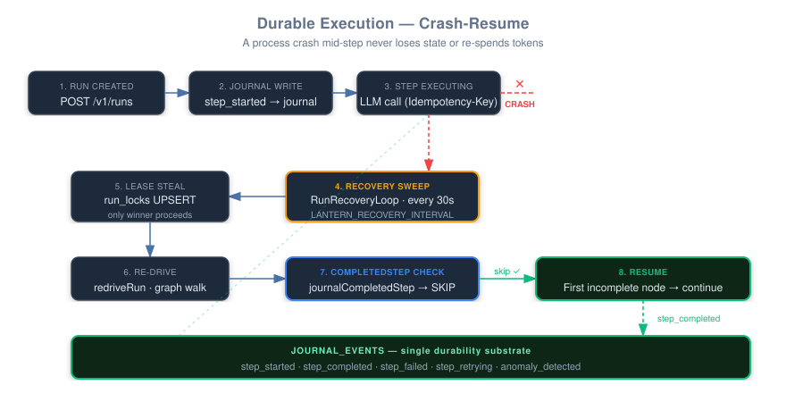
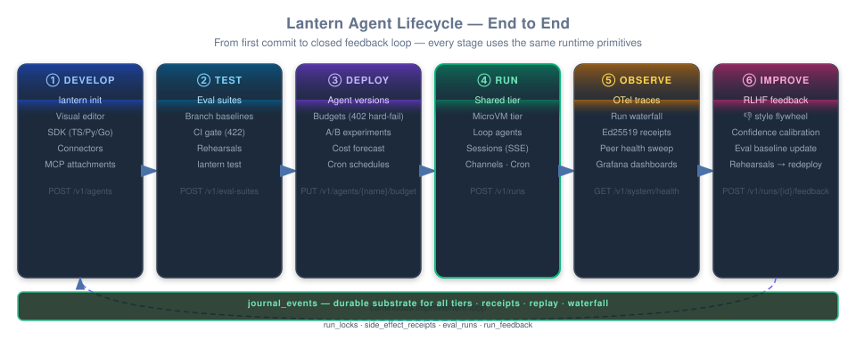

# Agent Runtime

> **Definitive reference for how Lantern runs agents.** Read this before touching `services/control-plane/internal/handlers/rest.go`, the workflow interpreter, the harness, or the scheduler/manager pair.

Related: [ADR 0022 — Two-tier routing](../adr/0022-two-tier-agent-runtime.md) · [04b — MicroVM productionization](04b-microvm-productionization.md) · [01 — Overview](01-overview.md)

---

## The two-tier model

Every agent run executes in one of two tiers. The tier is a property of the **agent version** (its `manifest.isolation` field), not of the caller.

| | **Shared tier** | **MicroVM tier** |
|---|---|---|
| `isolation` value | `"shared"` (default, or absent) | `"microvm"` |
| Executor | Goroutine inside the control-plane (`executeRunInlineSync`) | W12 stack: scheduler → manager → VM harness |
| Typical latency | ~50–200ms to first token | ~150ms (warm pool) to ~1.5s (cold boot) |
| Checkpointing | `journal_events` per step; crash-replay via recovery sweep | `journal_events` via harness→manager report path |
| Crash resume | Recovery sweep re-drives within 30s | VM lifecycle owns it; recovery sweep skips microVM runs |
| Isolation | Trust boundary: same OS process as control-plane | Separate kernel (gVisor) or separate hypervisor (Kata microVM) |
| Egress control | Outbound allowed (trust-first-party code) | Harness enforces allowlist + iptables REDIRECT; deny-default |
| Secret vending | Resolved inline via `lantern.secret/…` refs | Short-TTL JWT over vsock; harness caches with declared TTL |
| Idempotency | `(run_id, step_id, attempt)` key on every LLM + connector call | Same key on every harness tool invocation |
| Use case | Loop agents, bridge replies, dashboard runs, trusted workflows | User-supplied code, `exec` tools, untrusted packages |
| Downgrade | N/A | **Never silently fallback to shared** — failure is explicit (`microvm_unavailable`) |

### Routing happens at run creation

When `POST /v1/runs` arrives, the control-plane reads `manifest.isolation` from the resolved agent version and calls either `executeRunInline` (shared) or `scheduleAgentSpec` (microVM). This decision cannot be overridden by the caller — a manifest declaring `"microvm"` is a security boundary.

Unknown values in `manifest.isolation` are rejected at **agent-version publish time** with HTTP 400, so typos fail at deploy, not at run time.

The workflow-engine service (`:50052`) is a third, dormant implementation of durable step execution. Per ADR 0022, it is not a routing tier. Its `llm_call`/`tool_call` dispatch is wired but no run path reaches it.

---

## Diagram: two-tier routing

<p align="center">
  
</p>

The isolation gate in the centre reads `manifest.isolation` from the resolved agent version. The journal at the bottom is the shared durability substrate for both tiers — receipts, replay, and the run waterfall all read from it.

---

## Shared tier

### Entry points {#entry-points}

Any of these creates a run on the shared tier (when the agent has no `isolation` field or has `"shared"`):

- `POST /v1/runs` (REST, SDK)
- `POST /v1/sessions/{id}/messages` (interactive session — triggers an inline run for each turn)
- Cron scheduler (`schedules` table, `next_fire_at`-driven)
- Loop agent tick (same inline path, agent created via `POST /v1/agents/loop`)
- Bridge-triggered (WhatsApp, iMessage — calls `POST /v1/runs` via the bridge's `AgentClient`)

### Run creation {#run-creation}

1. `POST /v1/runs` hits the control plane, which validates input schema, checks tenant quota and per-tenant budget (`agent_budgets` + `agent_usage_daily`), and creates a `runs` row with `status=queued`.
2. The run executor acquires a `run_locks` row (UPSERT with `(run_id, worker_id, expires_at)`). Only the replica that wins this UPSERT proceeds; other replicas skip silently.
3. A goroutine calls `executeRunInline(runID, tenantID, agentName, input)`, which calls `executeRunInlineSync` synchronously inside the goroutine.
4. The `runs` row flips to `status=running`.

### Step execution {#step-execution}

`executeRunInlineSync` drives either:

- **Plain LLM tool-use loop** — for agents with no `workflow` JSONB; loops calling the model router until the model returns no more tool calls, then writes the final output.
- **Workflow interpreter** (`runWorkflowIfPresent`) — for agents with a `workflow` JSONB graph; calls `workflow.Run(ctx, deps, graph, input)`.

Before every LLM call, the executor calls `checkCachedLLMStep`, which queries `journal_events` for a prior `step_completed` row. If found, it returns the cached output and skips the LLM call entirely. This is the "no re-spent tokens" guarantee on crash-replay.

The workflow interpreter (`internal/workflow/interpreter.go`) walks the graph topologically from the `trigger` node. Supported node types: `trigger`, `ai-step`, `tool`, `connector`, `condition`, `loop`, `approval`, `subagent`, `end`.

---

## Durable execution

### Journal events {#journal-events}

`journal_events` is the single durability substrate. Both tiers write to it. Schema: `(run_id, seq, kind, step_id, attempt, payload BYTEA)`. The `seq` column is a monotone counter computed at insert time via `COALESCE((SELECT MAX(seq) FROM journal_events WHERE run_id = $1), 0) + 1`.

Events:

| `kind` | When written |
|---|---|
| `step_started` | Before any side-effect for a node |
| `step_completed` | After the side-effect completes successfully |
| `step_failed` | After a non-retryable failure |
| `step_retrying` | Between attempts (includes `attempt`, `of`, `error`) |
| `microvm:schedule` | Shared-tier journal event for microVM-tier dispatch |
| `anomaly_detected` | Token budget breach mid-run |
| `confidence_evaluated` | Confidence gate decision (when enabled) |

The run waterfall in the dashboard (`apps/web/app/(dashboard)/runs/[id]`) reads these events via `GET /v1/runs/{id}/events` (SSE) to render the step timeline.

### Run locks {#run-locks}

`run_locks` enforces exactly-one-executor across replicas. Columns: `run_id`, `worker_id`, `expires_at`. The UPSERT only proceeds when either no row exists or `expires_at` is in the past — a live worker renews before expiry. `recoveryLockTTL = 10 minutes`.

### Recovery sweep {#recovery-sweep}

`RunRecoveryLoop` runs every 30 seconds (configurable via `LANTERN_RECOVERY_INTERVAL`, a Go duration string; set `"0"` or `"off"` to disable). Each pass:

1. Queries `runs` for rows where `status IN ('running','queued')` and the matching `run_locks` row is absent or expired.
2. Caps at `recoverySweepLimit = 20` rows per pass to bound startup latency.
3. For each candidate: attempts the `run_locks` UPSERT. The winning replica proceeds; losers skip silently.
4. The winner calls `redriveRun` → `runWorkflowIfPresent` / `executeRunInlineSync`.

**MicroVM runs are skipped by the recovery sweep.** The VM lifecycle (scheduler + manager) owns those; the sweep touching them would race with the scheduler's own state machine.

### CompletedStep replay {#completedstep-replay}

The workflow interpreter receives a `Deps.CompletedStep` hook wired to `journalCompletedStep`. For every side-effecting node (`ai-step`, `tool`, `connector`, `subagent`, `approval`), the interpreter checks `journal_events` for a `step_completed` row before executing the node. If one exists, it returns the cached output and marks the node done — the underlying side-effect is never re-invoked.

This is the "crash-replay never re-executes completed nodes" guarantee. It is idempotent: a re-drive re-walks the graph from the trigger, but only the first incomplete node onwards actually runs.

The plain-LLM path has the analogous `checkCachedLLMStep` cache.

### Idempotency keys {#idempotency}

Every external side-effect carries a key derived from `(run_id, step_id, attempt)`:

- **LLM provider calls** — `Idempotency-Key` HTTP header on every request to OpenAI and Anthropic. Derived in `internal/handlers/llm_idempotency.go` via a one-way hash. A crash-replay retry to the same provider dedups at the provider instead of double-billing.
- **Connector/tool calls** — `claimSideEffect` reserves an `(run:step:attempt)` key in `side_effect_receipts` before dispatching. A re-drive that reaches the same step finds the receipt and short-circuits.
- **MicroVM dispatch** — `microvm:schedule` step event in `journal_events`; the UPSERT uses `ON CONFLICT DO NOTHING`.

---

## Diagram: crash-resume loop

<p align="center">
  
</p>

The CompletedStep check (step 7) is the key invariant: completed nodes are never re-invoked regardless of how many times the recovery sweep re-drives the run.

---

## Per-step retry policy {#per-step-retry}

Workflow nodes can declare a retry policy in `node.Data["retry"]`:

```json
{
  "retry": {
    "maxAttempts": 3,
    "backoffMs": 500,
    "retryableClasses": ["llm", "connector"]
  }
}
```

`maxAttempts` is total attempts including the first (default `1` = no retry). `backoffMs` is a fixed wait between attempts. `retryableClasses` scopes which failures retry; empty means retry on any error.

Supported classes:

| Class | Triggers on |
|---|---|
| `any` | Any error |
| `timeout` | `context.DeadlineExceeded` or `context.Canceled` |
| `llm` / `ai-step` | Node type is `ai-step` |
| `connector` | Node type is `connector` |
| `tool` | Node type is `tool` |

Between attempts the interpreter waits `backoffMs` and journals a `step_retrying` event with `{attempt, of, error}`, so the run waterfall shows retry history.

**Retry wraps `executeNode` in the main run loop, outside the CompletedStep check.** A crash-replay skips a node only when it has a `step_completed` row — it does not re-retry a node that was still mid-retry when the crash happened.

---

## MicroVM tier

The MicroVM tier reuses the W12 stack described in detail in [04b — MicroVM productionization](04b-microvm-productionization.md). This section covers only what is specific to two-tier routing.

### Dispatch path

When `manifest.isolation == "microvm"`, the run executor calls `scheduleAgentSpec`, which:

1. Journals a `microvm:schedule` `step_started` event.
2. Dials the runtime-scheduler (`LANTERN_SCHEDULER_GRPC_ADDR`) and calls `RuntimeScheduler.Schedule(spec)`.
3. On success: inserts a `vms` row, journals `step_completed` with the `vm_id`, and returns.
4. On any error (scheduler unreachable, quota exceeded, stub): marks the run `failed` with code `microvm_unavailable` and journals `step_failed`. **No fallback to the shared tier.**

The scheduler performs 5-factor placement (warm pool, region, cost, health, fair-share) and dispatches to the runtime-manager on the selected node.

### In-guest tool runner {#in-guest-tool-runner}

As of commit f26c7c7 (2026-07-23), the harness contains a typed tool registry in `services/harness/src/tool_runner.rs`. The manager dispatches tool calls to it via the existing `RuntimeHarness.Exec` gRPC stream using a `__lantern_tool_call__` sentinel in `argv[0]` followed by a JSON envelope. The harness intercepts the sentinel **before** the general exec audit path, so serialized arguments (which may hold secrets) never appear in audit logs (invariant #10).

Built-in tools:

| Tool | Description |
|---|---|
| `shell_exec` | Run a shell command with enforced timeout; returns stdout, stderr, exit code |
| `http_fetch` | HTTP request forced through the `127.0.0.1:3128` egress-allowlist proxy; 1 MiB response cap |

Unknown tool names return a typed `TOOL_STATUS_ERROR`. `TOOL_STATUS_UNAVAILABLE` now strictly means the VM is not found or the harness is unreachable — it no longer means "no runner exists."

The manager maps `ToolResult → ToolStatus`. Audit events record tool name, duration, and status — never the arguments.

### Journal events from the microVM tier

The harness streams `step_started`/`step_completed`/`step_failed` events to the manager via the `RuntimeHarness.Report` RPC. The manager writes them to `journal_events` via the control-plane's report ingestion path, so run detail, receipts, and replay are tier-agnostic.

---

## Sessions {#sessions}

Interactive sessions (`POST /v1/sessions`) run on the shared tier. Each `POST /v1/sessions/{id}/messages` call triggers an inline run for that turn. Sessions maintain a `messages` JSONB column on the `sessions` table and stream events via `GET /v1/sessions/{id}/events` (SSE).

Sessions are not workflow-graph runs — they use the plain-LLM tool-use loop. The same durability primitives apply: each turn's LLM call carries an idempotency key and the result is journaled.

---

## Scheduling: cron and loop cadences {#scheduling}

### Cron schedules

The `schedules` table (`cron_expr`, `next_fire_at`, `timezone`) drives periodic runs. The scheduler (`internal/scheduler/`) queries `next_fire_at <= now()` on a tick, creates a run via `POST /v1/runs`, and advances `next_fire_at` to the next cron-computed fire time. Timezone is per-schedule (`LANTERN_DEFAULT_TIMEZONE` env as deployment-wide default; UTC when unset).

### Loop agents and tiers

Loop agents (created via `POST /v1/agents/loop`, visible on the Agents page) are ordinary agents with a schedule row. The tier is set by their manifest like any other agent. The five loop tiers:

| Tier | Schedule | Example agents |
|---|---|---|
| `nano` | Event-driven (no cron) | commute-copilot, health-coach |
| `micro` | Every 5 min (`*/5 * * * *`) | ai-radar |
| `meso` | Every 45 min (`*/45 * * * *`) | inbox-triage |
| `macro` | Daily 8am (`0 8 * * *`) | financial-sentinel, chief-of-staff |
| `mega` | Weekly Mon 9am (`0 9 * * 1`) | relationship-keeper |

All loop agents run on the shared tier by default (they are trusted first-party code).

---

## Service-health sweep {#health-sweep}

`RunHealthSweep` (launched from `main.go`) probes configured peer services via TCP every 60 seconds (`LANTERN_HEALTH_SWEEP_INTERVAL`, Go duration string; `"0"` or `"off"` disables). Probed when the corresponding address env var is set:

| Service | Env var | Notes |
|---|---|---|
| model-router | `LANTERN_MODEL_ROUTER_ADDR` (default `model-router:50053`) | Only probed when `LANTERN_USE_MODEL_ROUTER=1` or addr is non-default |
| runtime-scheduler | `LANTERN_SCHEDULER_GRPC_ADDR` | |
| runtime-manager | `LANTERN_DEFAULT_MANAGER_ADDR` | |
| workflow-engine | `LANTERN_WORKFLOW_ENGINE_ADDR` (default `workflow-engine:50052`) | Optional; no gRPC dial, TCP probe only |

A service is declared **DOWN** after `downThreshold = 3` consecutive failures. Alerts fire only on state transitions (UP→DOWN, DOWN→UP) via `sendSelfNote` to the owner's self-chat. No alert storms.

Read-only snapshot for the dashboard: `GET /v1/system/health` (JWT-authed).

```json
{
  "services": [
    {
      "name": "runtime-manager",
      "addr": "localhost:50054",
      "up": false,
      "consecutiveFailures": 5,
      "lastChecked": "2026-07-23T10:00:00Z",
      "lastTransition": "2026-07-23T09:57:00Z"
    }
  ]
}
```

This closes the "runtime-manager crash-looped for days unnoticed" failure mode described in ADR 0022.

---

## Observability {#observability}

### OTel span attribute contract

Every span emitted anywhere in the stack uses these keys (defined in `internal/middleware/span.go`):

| Attribute | Key | Set by |
|---|---|---|
| Tenant | `lantern.tenant_id` | HTTP enrichment middleware + gRPC tracing interceptor |
| User | `lantern.user_id` | Same |
| Run | `lantern.run_id` | Same + inline executor |
| Step | `lantern.step_id` | Inline executor per step |

`EnrichSpan(ctx, tenantID, userID, runID, stepID)` is the single chokepoint both HTTP and gRPC entry points use, so the keys never drift between them. It is a no-op when telemetry is disabled.

### Additional attributes on the runtime path

The microVM tier adds `vm_id`, `isolation_class`, and `agent_version` on scheduler/manager spans. The model-router adds `model_used`, `cost_usd`, `tokens_in`, `tokens_out` on completion spans.

### W3C traceparent propagation

`traceparent` flows: control-plane → scheduler → manager → harness → worker. A single trace covers the entire spawn chain.

### Metrics (microVM tier)

`lantern_vm_boot_duration_seconds{class}` · `lantern_vm_running{node,class}` · `lantern_warm_pool_size{class,digest}` · `lantern_egress_denied_total{vm_id}`

---

## Diagram: end-to-end lifecycle

<p align="center">
  
</p>

The loop back from Improve to Develop closes via eval baseline updates and rehearsals. Each stage is covered in the [self-service walkthrough](../guides/self-service-e2e.md).

---

## Tier guarantee summary

| Guarantee | Shared tier | MicroVM tier |
|---|---|---|
| **Crash safety** | Recovery sweep re-drives within 30s | VM lifecycle; scheduler reschedules on idempotent VMs |
| **No double side-effects** | `side_effect_receipts` + LLM `Idempotency-Key` | Same keys on every harness tool call |
| **No re-spent tokens on crash** | `checkCachedLLMStep` + `CompletedStep` journal replay | `CompletedStep` via report path |
| **Isolation** | Same OS process — trust first-party code | Separate kernel (gVisor) or hypervisor (Kata); egress deny-default |
| **Egress** | Outbound unrestricted | Harness allowlist; deny-default; iptables REDIRECT required in prod |
| **Secret exposure** | Resolved inline at step time; never logged | Short-TTL JWT over vsock; args stripped from audit |
| **Latency to first token** | ~50–200ms | ~150ms warm, ~1.5s cold |
| **Per-step retry** | `node.Data["retry"]` policy in the workflow graph | Same, via the interpreter inside the VM |
| **Receipts** | Ed25519 over `journal_events` SHA-256 | Same — report path writes to the same table |

---

## See also

- [ADR 0022 — Two-tier runtime routing](../adr/0022-two-tier-agent-runtime.md)
- [04b — MicroVM productionization](04b-microvm-productionization.md) — scheduler/manager/harness wiring in depth
- [04-runtime-isolation.md](04-runtime-isolation.md) — isolation classes, RuntimeClass tiers, fail-closed gate
- [05-workflow-engine.md](05-workflow-engine.md) — workflow interpreter design
- [10-security.md](10-security.md) — threat model, mTLS, secrets
- [Self-service walkthrough](../guides/self-service-e2e.md) — copy-pasteable dev → deploy → observe journey
- [Headless agent quickstart](../guides/headless-agent-quickstart.md)
